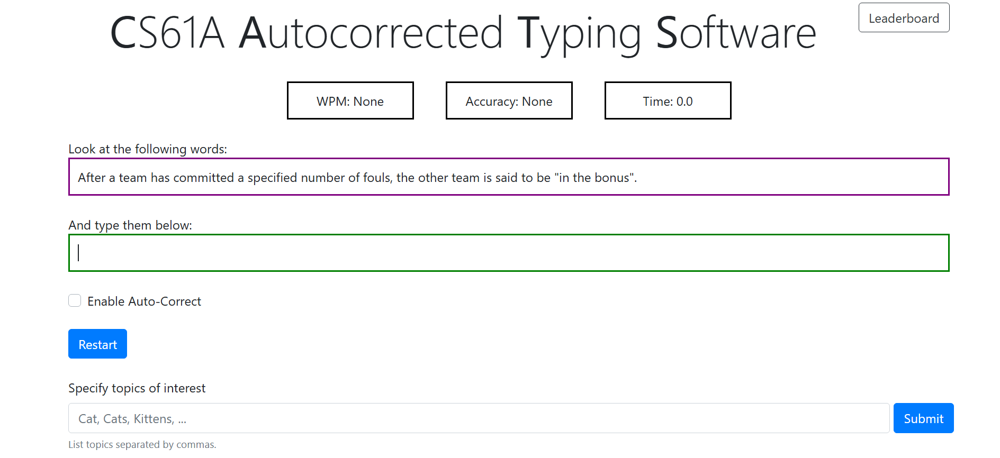

# Cats Typing Test (CS61A Project)

This is a Python implementation of the core logic for a typing speed and accuracy analysis tool, completed as a programming project for UC Berkeley's CS61A course.

## Features

- Implemented the main algorithms for analyzing typing speed and accuracy
- Developed key functions for auto-correction, progress tracking, and scoring
- Focused on functional programming (recursion, higher-order functions)

## Technologies

- Python 3
- Functional programming concepts

## How to Run

1. Make sure you have Python 3 installed.  

2. Open a terminal (CMD/PowerShell), and change directory to the project folder:  

   cd your\path\cats-typing-test
   
4. Run the GUI version:

   py cats_gui.py
   
## Note

- The GUI, data files, and testing framework were provided by the course staff.  
  My contribution was to implement the main logic and required functions according to project specifications.

## What I Learned

- Practiced core Python programming skills
- Improved understanding of recursion and code modularization
- Learned to read and implement complex project specifications

---

> This code was written independently as part of CS61A coursework for learning and practice purposes.

---

# Cats 打字测试项目（CS61A课程项目）

这是我用 Python 独立完成的打字速度与准确率分析工具的核心算法，属于加州大学伯克利分校 CS61A 课程的大型编程作业之一。

## 功能亮点

- 实现了多用户打字速度与准确率分析的主算法
- 编写了自动纠错、进度统计、评分等核心功能
- 采用递归与高阶函数，注重函数式编程思想

## 技术栈

- Python 3
- 函数式编程思想

## 如何运行

1. 请确保已安装 Python 3。

2. 打开命令行窗口（CMD/PowerShell），切换到项目目录：
   cd your\path\cats-typing-test

4. 运行图形界面版：
   py cats_gui.py

## 说明

- 界面（GUI）、数据文件和测试脚本均由课程提供。本人实现了所有核心功能与算法部分，严格按照项目规范独立完成。

## 我的收获

- 熟悉了Python算法开发流程
- 强化了递归和代码模块化理解
- 学会了阅读和实现复杂项目需求

---

> 本项目代码为本人独立完成，仅用于学习和展示用途。
